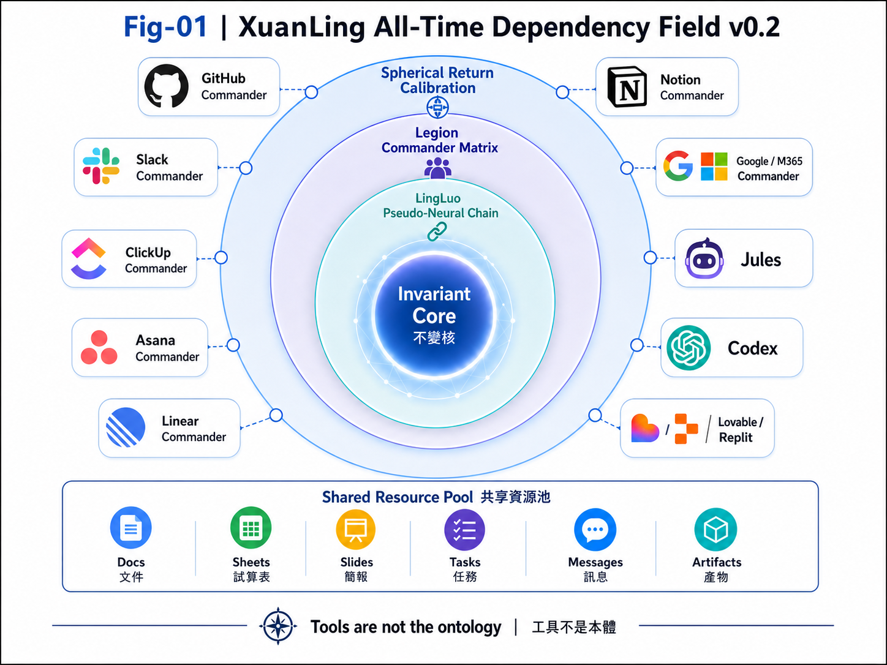
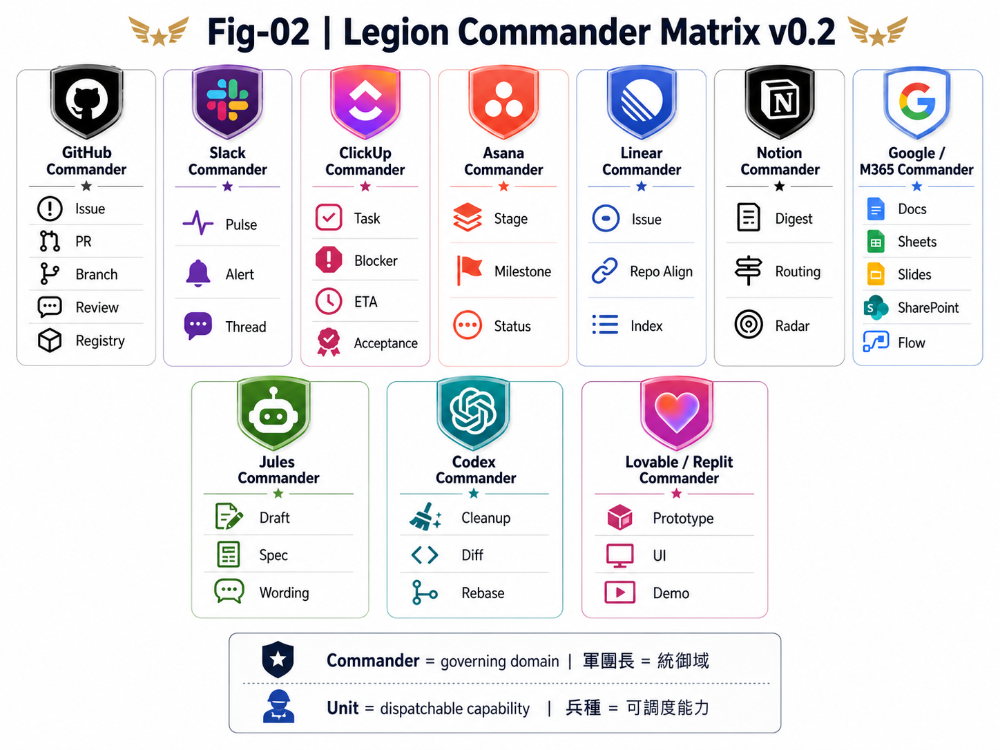
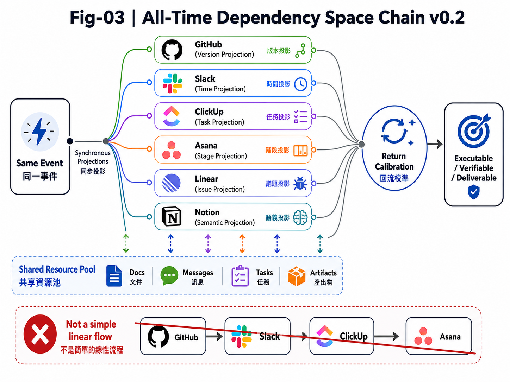
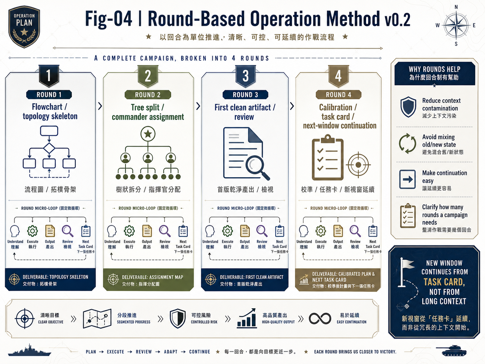

# XuanLing All-Time Dependency Field

## Operation Manual v0.1

**Subtitle:** Legion Commander Matrix × LingLuo Pseudo-Neural Chain × Spherical-Topology Return Calibration

---

## 0. Document Position

This document defines the operating method for **XuanLing All-Time Dependency Field**.

It is **not** a runtime, API layer, database, automation platform, or executable software system.
It is an operation manual for coordinating multi-tool, multi-task, multi-document, multi-model, multi-evidence, and multi-field return-calibration work.

Core formula:

```text
XuanLing All-Time Dependency Field
= Invariant Core × Legion Commander Matrix × LingLuo Pseudo-Neural Chain × Spherical-Topology Return Calibration
```

Chinese internal reference:

```text
翾靈全時依存場
```

For diagram titles, use the English name **XuanLing** to avoid character-shape instability in generated visual assets.

---

## 1. Invariant Core

All tasks, tools, documents, roles, models, and external systems must not rewrite the invariant core.

Core definition:

```text
翾靈 = 不變核 × 多鏈場域 × 回流校準
```

Operating principles:

1. Tools are not the ontology.
2. A legion commander is a governing domain, not merely a tool name.
3. The same event may be synchronously projected into multiple legion commanders.
4. Previous maps are preserved as lineage and anti-regression references; new maps are mapped outward from them.
5. Every output must be able to return for calibration.

---

## 2. Foundation Figure Package v0.2

Figures are visual indexes only. Formal definitions remain in this Markdown document.

### Fig-01 — XuanLing All-Time Dependency Field v0.2



**Purpose:** master field figure.

This figure expresses the carrying structure of XuanLing. The center is the invariant core. Around it are three carrying layers:

```text
LingLuo Pseudo-Neural Chain
→ Legion Commander Matrix
→ Spherical-Topology Return Calibration
```

Tool nodes sit on the spherical surface layer. They are not the system itself.
GitHub, Slack, ClickUp, Asana, Linear, Notion, Google, M365, Jules, Codex, Lovable, and Replit are tool-ecosystem nodes, legion commanders, or supporting units.

Fixed reading:

```text
Center remains invariant.
Structure may vary.
Return is law.
All domains are dependency-bound.
```

---

### Fig-02 — Legion Commander Matrix v0.2



**Purpose:** commander and unit recognition figure.

A legion commander is not a single tool. It is a governing domain. Each commander has its own units and may share resources with other commanders.

Core definition:

```text
Legion Commander = governing domain
Unit = dispatchable capability
Shared Resource Pool = material, document, task, message, or artifact that multiple commanders can use
```

Shared resources may include:

```text
Docs
Sheets
Slides
Tasks
Messages
Artifacts
```

---

### Fig-03 — All-Time Dependency Space Chain v0.2



**Purpose:** synchronous projection figure.

Tasks should not be treated as a simple linear flow:

```text
GitHub → Slack → ClickUp → Asana
```

Instead, one event is projected synchronously:

```text
Same Event
→ GitHub | Version Projection
→ Slack | Time Projection
→ ClickUp | Task Projection
→ Asana | Stage Projection
→ Linear | Issue Projection
→ Notion | Semantic Projection
→ Return Calibration
```

The target state is:

```text
Executable / Verifiable / Deliverable
```

---

### Fig-04 — Round-Based Operation Method v0.2



**Purpose:** round-based operating discipline and next-task-card continuation rule.

All windows should operate by rounds. Do not attempt to finish everything in one pass.
Each round handles one main slice. At the end of every round, the output must be checked, and a next-round task card must be produced.

Fixed steps:

```text
1. Understanding Version
2. Single-Round Execution
3. Round Output
4. Round Review
5. Task Card
6. New-Window Continuation
```

---

## 3. Legion Commander Matrix Rules

### 3.1 GitHub Commander

Position:

```text
Source of Truth / Issue / PR / Branch / Commit / Review / Registry / Merge Gate
```

Suitable for:

- architecture documents
- PR review
- branch management
- repo hygiene
- registry and index updates
- merge-readiness judgment

Not suitable for:

- private trust-core storage
- unsupported inference as formal fact
- framing XuanLing as runtime, API, database, or automation system

---

### 3.2 Slack Commander

Position:

```text
Event Pulse / Time Signal / Short Return Stream
```

Suitable for:

- critical event return
- new blocker notice
- PR-formed signal
- decision-required short message

Not suitable for:

- long-form documents
- file source of truth
- dense task execution detail

---

### 3.3 ClickUp Commander

Position:

```text
Task Muscle / Blocker / ETA / Acceptance Criteria / Execution Tracking
```

Suitable for:

- task decomposition
- blocker tracking
- owner and ETA
- acceptance criteria
- drill records

Not suitable for:

- source-of-truth architecture
- mother-law rewrite
- unresolved conceptual dumping

---

### 3.4 Asana Commander

Position:

```text
Stage Staff / Stage Report / Management View / Control-Board Review
```

Suitable for:

- stage report
- management summary
- milestone
- project status
- periodic review

Not suitable for:

- repo artifact source
- detailed diff management
- replacing ClickUp as execution layer

---

### 3.5 Linear Commander

Position:

```text
Issue Brainstem / Repo Alignment / Codex Task Index
```

Suitable for:

- issue state
- repo alignment
- Codex cleanup task index
- PR / issue relationship judgment

Not suitable for:

- document drafting source
- master-map ontology
- replacing GitHub source of truth

---

### 3.6 Notion Commander

Position:

```text
Semantic Cortex / Digest / Routing Manual / Cross-Source Radar
```

Suitable for:

- summaries
- routing manual
- decision log
- concept digestion
- semantic mapping

Current status:

```text
Can operate as cross-source radar.
Stable write-entry still requires further drill.
```

Not suitable for:

- formal repo source
- real-time event stream
- public storage of private trust-core material

---

### 3.7 Google / M365 Commander

Position:

```text
Document and Workflow Base Layer
```

Google is suitable for:

- Docs
- Sheets
- Slides
- Drive
- Source Ledger
- Evidence Matrix
- report drafts

M365 is suitable for:

- SharePoint
- Power Automate
- Outlook
- Teams
- company workflow
- document review chain

Not suitable for:

- mixing company data with public-facing interface material
- converting unverified material into formal conclusion
- drifting from M365 workflow into abstract mother-architecture unless explicitly required

---

### 3.8 Jules / Codex

Jules position:

```text
Document Drafting Nerve
```

Suitable for:

- conservative architecture draft
- wording and semantic lowering
- specification drafting

Codex position:

```text
Repo Hygiene / Diff Cleanup / Registry-Index Cleanup Nerve
```

Suitable for:

- rebase
- branch hygiene
- changed-file cleanup
- registry / index minimal update
- PR pollution cleanup

Fixed division:

```text
Jules drafts content.
Codex cleans repository state.
ChatGPT reviews boundary and merge order.
User gives final approval.
```

---

## 4. Round-Based Operation SOP

### Step 1 — Understanding Version

Confirm the current round:

```text
Goal
Scope
Input
Output format
Negative constraints
Acceptance criteria
```

### Step 2 — Single-Round Execution

Each round handles one main slice.

Do not mix the following unless the round is explicitly marked as cross-mapping:

```text
mother-architecture judgment
external interface operation
GitHub cleanup
company strategy report
image generation
task governance
private narrative
```

### Step 3 — Round Output

Output must be usable. It may be:

```text
document
figure
table
task card
judgment
workflow
instruction
SOP
PR review
```

### Step 4 — Round Review

Check:

```text
Does it drift from the invariant core?
Does it mix multiple windows?
Does it mix old and new states?
Does it turn inference into fact?
Does it let a tool define the task?
Does it need semantic lowering?
Does it need return to the mother frame?
```

### Step 5 — Task Card

Every round must end with a next-round task card.

Fixed fields:

```text
Card_ID
Task Name
Domain
Goal
Input
Deliverables
Negative Constraints
Acceptance Criteria
Recommended Next Step
```

### Step 6 — New-Window Continuation

A new window should continue from the task card, not from a long context dump.

Purpose:

```text
avoid context contamination
avoid mixing old and new states
avoid cross-window pollution
make continuation simple
```

---

## 5. Placement Rules

| Node | Correct Placement | Should Not Carry |
|---|---|---|
| GitHub | formal architecture, PR, version, registry | private core, unsupported inference |
| Slack | short event pulse | long document storage |
| ClickUp | task governance, blocker, acceptance | source-of-truth mother frame |
| Asana | stage report, management view | detailed task and diff work |
| Linear | issue brainstem, repo alignment | document source |
| Notion | digest, routing manual, semantic radar | formal repo artifact |
| Google Docs | drafts, reports, manuals | repo version gate |
| Google Sheets | Source Ledger, Evidence Matrix | unverified conclusion |
| Slides | briefing and GM-facing outputs | detailed evidence database |
| M365 | company workflow, SharePoint review chain | abstract mother-architecture |
| Jules | document drafting | repo hygiene |
| Codex | repo cleanup | architecture semantic authority |
| Lovable / Replit | prototype, demo, UI shell | mother-frame source of truth |

---

## 6. Evidence and Formal-Output Rules

Formal reports, white papers, and company briefings must classify claims as:

```text
Fact
Inference
Strategic Interpretation
Pending
Exclude
```

Forbidden conversions:

```text
media report = fact
investment signal = project source
capability description = cooperation intent
pending item = formal conclusion
```

Unhardened information may only remain in:

```text
Radar
Pending
Strategic Signal
```

It must not enter the formal main text.

---

## 7. Scheduler Rules

All automatic schedules are currently disabled.

New rule:

```text
Scheduler is not the system body.
Scheduler is only a tactical trigger.
Manual trigger has priority.
Only restart a local schedule when clearly necessary.
Do not restore the full 00-04 schedule system by default.
```

A schedule may be re-enabled only when:

```text
a PR enters pre-merge monitoring
an issue forms a clear blocking path
the user explicitly requests tracking
there is time-sensitive risk
cost boundary is controlled
```

---

## 8. GitHub Placement Decision

Decision: **Conditional Pass**.

This document should be added as a companion operation manual, not as a replacement for any root map or mother-law document.

Recommended path:

```text
docs/xuanling/XUANLING_ALL_TIME_DEPENDENCY_FIELD_OPERATION_MANUAL_v0.1.md
```

Recommended branch:

```text
docs/xadf-operation-manual-v0.1
```

PR boundary:

```text
Add one new operation manual.
Do not modify mother-law.
Do not modify L0.
Do not reactivate schedules.
Do not modify registry/index unless a later Codex cleanup step determines a minimal index update is required.
Do not merge automatically.
```

---

## 9. Round Review

1. Mother-law is not rewritten.
2. XuanLing is not framed as runtime, API, or database.
3. Tools are positioned as commanders, units, or nodes, not as the system body.
4. Schedules remain disabled unless locally re-enabled by explicit need.
5. Private trust-core material is excluded.
6. Figures are visual indexes only; Markdown remains the authoritative definition source.

---

## 10. Next Round Task Card

```text
NEXT ROUND TASK CARD

Card_ID:
XADF-R08-PR86-FINAL-REVIEW-v0.1

Task Name:
Review PR #86 after figure package insertion

Domain:
GitHub Commander / Mother-Architecture Documentation / Repo Hygiene

Goal:
Confirm that PR #86 remains a conservative companion operation-manual PR after figure package insertion.

Input:
1. docs/xuanling/XUANLING_ALL_TIME_DEPENDENCY_FIELD_OPERATION_MANUAL_v0.1.md
2. docs/xuanling/figures/Fig-01_XuanLing_All-Time_Dependency_Field_v0.2.png
3. docs/xuanling/figures/Fig-02_Legion_Commander_Matrix_v0.2.png
4. docs/xuanling/figures/Fig-03_All-Time_Dependency_Space_Chain_v0.2.png
5. docs/xuanling/figures/Fig-04_Round-Based_Operation_Method_v0.2.png
6. PR #86

Deliverables:
1. PR changed-file check
2. Image-link validation
3. Semantic boundary check
4. Mother-law no-rewrite check
5. Runtime/API/database drift check
6. Decision: READY_TO_REVIEW / CODEX_CLEANUP_NEEDED / USER_DECISION_REQUIRED

Negative Constraints:
- Do not merge automatically.
- Do not mix this PR with #82 cleanup.
- Do not fold this PR into #83 Master Map v0.2.
- Do not add registry/index updates unless separately required.

Acceptance Criteria:
- Changed files contain only the operation manual and four figure files.
- Image links resolve relative to docs/xuanling/.
- The manual defines XuanLing as dependency field / carrying topology.
- Legion Commander Matrix and Round-Based Operation Method are clear.
- No private trust-core material appears.
- No schedule reactivation appears.

Recommended Next Step:
Run R08 final review and decide whether a separate Codex minimal index registration PR is needed later.
```
